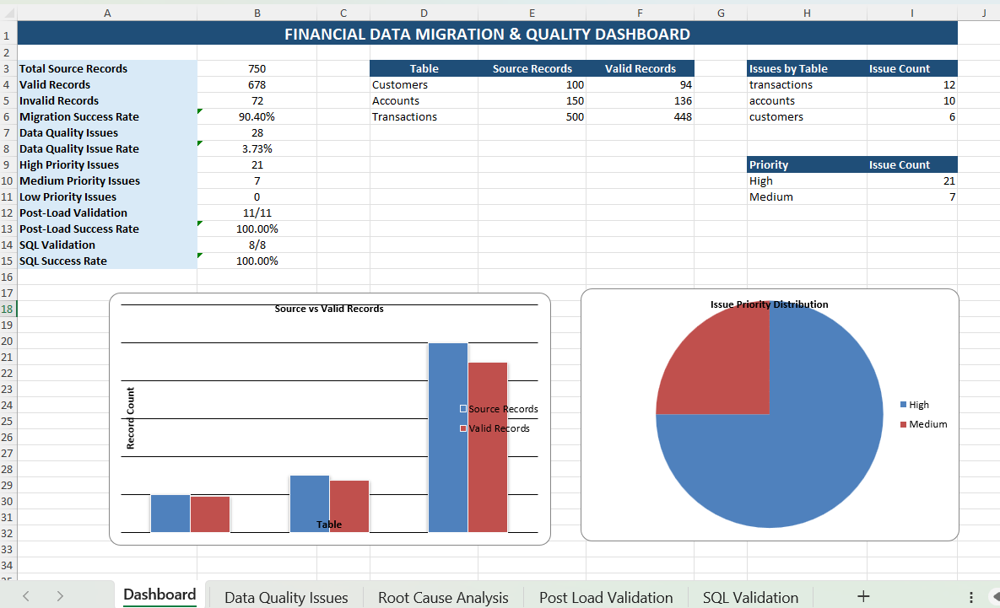

# Financial Data Migration & Validation Platform

A comprehensive end-to-end financial data migration and validation platform built using Python, SQL, SQLite, Pandas, and Excel.

The project simulates a real-world financial data onboarding and migration workflow by generating financial data, injecting data quality issues, validating and cleansing records, processing data dependencies, loading valid records into a target database, performing post-load reconciliation, running SQL validation checks, conducting root cause analysis, and generating an automated Excel data quality dashboard.

---

## Project Overview

Data migration projects require more than simply moving records from a source system to a target system. Data must be validated for accuracy, completeness, consistency, uniqueness, and referential integrity before and after migration.

This project demonstrates a complete data validation workflow for three financial datasets:

- Customers
- Accounts
- Transactions

The platform identifies data quality issues, separates valid and invalid records, handles data dependencies between tables, loads validated data into a target SQLite database, and performs reconciliation and validation checks.

---

# Key Features

- Automated financial data generation
- Intentional data quality issue injection
- Data quality validation
- Data cleansing and invalid record segregation
- Dependency-aware data processing
- ETL data loading
- SQLite target database
- Post-load validation and reconciliation
- SQL-based data validation
- Referential integrity checks
- Duplicate detection
- Root Cause Analysis (RCA)
- Issue prioritization
- Automated Excel data quality dashboard
- CSV validation reports
- Modular Python validation architecture

---

# Project Workflow

```text
Raw Financial Data
       │
       ▼
Data Generation
       │
       ▼
Data Quality Issue Injection
       │
       ▼
Data Quality Validation
       │
       ▼
Data Cleansing & Processing
       │
       ▼
Dependency-Aware Validation
       │
       ▼
Valid / Invalid Record Separation
       │
       ▼
ETL Data Loading
       │
       ▼
SQLite Target Database
       │
       ▼
Post-Load Validation
       │
       ▼
SQL Validation & Reconciliation
       │
       ▼
Root Cause Analysis
       │
       ▼
Excel Data Quality Dashboard
```

---

# Data Model

The project works with three related financial datasets.

## Customers

| Column | Description |
|---|---|
| customer_id | Unique customer identifier |
| full_name | Customer name |
| email | Customer email address |
| phone | Customer phone number |
| city | Customer city |
| created_date | Customer creation date |

---

## Accounts

| Column | Description |
|---|---|
| account_id | Unique account identifier |
| customer_id | Customer identifier |
| account_type | Type of account |
| balance | Account balance |
| currency | Account currency |
| account_open_date | Account opening date |

Relationship:

```text
Customer
   │
   │ customer_id
   ▼
Account
```

Each account must reference a valid customer.

---

## Transactions

| Column | Description |
|---|---|
| transaction_id | Unique transaction identifier |
| account_id | Account identifier |
| transaction_date | Transaction date |
| transaction_type | Type of transaction |
| amount | Transaction amount |
| currency | Transaction currency |
| status | Transaction status |

Relationship:

```text
Customer
   │
   ▼
Account
   │
   ▼
Transaction
```

Each transaction must reference a valid account.

---

# Data Generation

Synthetic financial data is generated using Python and Faker.

The project generates:

- 100 Customers
- 150 Accounts
- 500 Transactions

The generated datasets are stored in:

```text
data/raw/
```

Files generated:

```text
customers.csv
accounts.csv
transactions.csv
```

Run the data generation process:

```bash
python src/generate_data.py
```

Example output:

```text
Financial data generated successfully!

Customers: 100
Accounts: 150
Transactions: 500
```

---

# Data Quality Issue Injection

To simulate real-world data migration challenges, intentional data quality issues are injected into the datasets.

The project introduces different types of issues such as:

- Missing values
- Duplicate records
- Invalid email values
- Invalid phone values
- Invalid account references
- Invalid customer references
- Invalid transaction values
- Invalid dates
- Negative or invalid balances
- Invalid transaction amounts
- Referential integrity violations

Run:

```bash
python src/inject_data_issues.py
```

Example output:

```text
Data quality issues injected successfully!

Issues introduced:
Customers: 5 issues
Accounts: 6 issues
Transactions: 8 issues
```

The processed datasets containing injected issues are stored in:

```text
data/processed/
```

Files:

```text
customers_with_issues.csv
accounts_with_issues.csv
transactions_with_issues.csv
```

---

# Data Quality Validation

The validation engine checks the datasets against defined data quality rules.

The validation process evaluates:

- Completeness
- Accuracy
- Consistency
- Uniqueness
- Validity
- Referential Integrity

The validation rules are organized by dataset.

---

## Customer Validation

Customer validation checks include:

- Missing customer ID
- Missing full name
- Missing email
- Invalid email format
- Missing phone
- Duplicate customer records

Example validation rules:

```text
C01
C02
C03
C04
C05
```

---

## Account Validation

Account validation checks include:

- Missing account ID
- Missing customer ID
- Invalid customer reference
- Missing account type
- Invalid balance
- Invalid currency
- Duplicate account records

Example validation rules:

```text
A01
A02
A03
A04
A05
A06
A07
```

---

## Transaction Validation

Transaction validation checks include:

- Missing transaction ID
- Missing account ID
- Invalid account reference
- Invalid transaction date
- Invalid transaction type
- Invalid transaction amount
- Invalid currency
- Invalid transaction status
- Duplicate transaction records

Example validation rules:

```text
T01
T02
T03
T04
T05
T06
T07
T08
```

---

# Validation Engine

The validation engine coordinates validation across all datasets.

Main file:

```text
src/validation_engine.py
```

Validators:

```text
src/validators/
├── __init__.py
├── customer_validator.py
├── account_validator.py
└── transaction_validator.py
```

The validation process generates a consolidated data quality report.

Run:

```bash
python src/validation_engine.py
```

The report is generated at:

```text
reports/data_quality_report.csv
```

---

# Data Processing

After validation, records are processed and separated into valid and invalid datasets.

The data processing workflow:

```text
Source Data
    │
    ▼
Validation
    │
    ├──────────────► Invalid Records
    │
    ▼
Valid Records
    │
    ▼
Dependency Validation
    │
    ▼
Cleaned Data
```

Run:

```bash
python src/data_processor.py
```

---

# Dependency-Aware Data Processing

One of the key features of this project is dependency-aware data processing.

The datasets have parent-child relationships:

```text
Customers
    │
    ▼
Accounts
    │
    ▼
Transactions
```

If a customer record is invalid:

```text
Invalid Customer
       │
       ▼
Related Account becomes invalid
       │
       ▼
Related Transaction becomes invalid
```

This prevents invalid parent records from causing referential integrity failures during migration.

The processing order is:

```text
1. Validate Customers
2. Process valid Customers
3. Validate Accounts
4. Check Account → Customer dependency
5. Process valid Accounts
6. Validate Transactions
7. Check Transaction → Account dependency
8. Process valid Transactions
```

---

# Data Processing Results

The project produces the following processed results.

## Customers

```text
Valid Customers: 94
Invalid Customers: 6
```

## Accounts

```text
Valid Accounts: 136
Invalid Accounts: 14
```

## Transactions

```text
Valid Transactions: 448
Invalid Transactions: 52
```

Total records:

```text
Total Source Records: 750
```

Valid records:

```text
678
```

Invalid records:

```text
72
```

Migration success rate:

```text
90.40%
```

---

# Cleaned Data

Validated records are stored in:

```text
data/cleaned/
```

Files:

```text
customers_cleaned.csv
accounts_cleaned.csv
transactions_cleaned.csv
```

Invalid records are stored separately in:

```text
data/invalid/
```

Files:

```text
customers_invalid.csv
accounts_invalid.csv
transactions_invalid.csv
```

This approach allows invalid records to be investigated without preventing valid records from being migrated.

---

# ETL Data Loading

The ETL loading process loads validated financial records into a SQLite target database.

ETL workflow:

```text
Extract
   │
   ▼
Cleaned CSV Files
   │
   ▼
Transform
   │
   ▼
Data Validation
Dependency Validation
Data Preparation
   │
   ▼
Load
   │
   ▼
SQLite Database
```

Run:

```bash
python src/etl_loader.py
```

Example output:

```text
Data loaded successfully!

Customers loaded: 94
Accounts loaded: 136
Transactions loaded: 448
```

---

# Target Database

The target database is:

```text
database/financial_data.db
```

Database technology:

```text
SQLite
```

Tables:

```text
customers
accounts
transactions
```

Relationship:

```text
customers
    │
    │ customer_id
    ▼
accounts
    │
    │ account_id
    ▼
transactions
```

---

# Post-Load Validation & Reconciliation

After loading data into the target database, post-load validation checks confirm that the migration was successful.

The following validations are performed:

- Record count validation
- Column validation
- Duplicate checks
- Referential integrity validation
- Source-to-target reconciliation

Run:

```bash
python src/post_load_validation.py
```

---

## Post-Load Validation Results

Example results:

```text
Total Checks: 11
Passed: 11
Failed: 0
```

Validation results:

```text
Record Count - Customers                 PASS
Record Count - Accounts                  PASS
Record Count - Transactions              PASS

Column Check - Customers                 PASS
Column Check - Accounts                  PASS
Column Check - Transactions              PASS

Duplicate Check - Customers              PASS
Duplicate Check - Accounts               PASS
Duplicate Check - Transactions           PASS

Referential Integrity - Accounts         PASS
Referential Integrity - Transactions     PASS
```

Report:

```text
reports/post_load_validation_report.csv
```

---

# SQL Data Validation

SQL validation checks are performed directly against the target SQLite database.

Run:

```bash
python src/sql_validation.py
```

The SQL validation process checks:

- Null values
- Duplicate records
- Customer integrity
- Account integrity
- Transaction integrity
- Account to Customer relationships
- Transaction to Account relationships

---

# SQL Validation Results

Example output:

```text
SQL DATA VALIDATION SUMMARY
```

```text
customers_null_check                     PASS
accounts_null_check                      PASS
transactions_null_check                  PASS

duplicate_customers                      PASS
duplicate_accounts                       PASS
duplicate_transactions                   PASS

invalid_account_customer_reference       PASS
invalid_transaction_account_reference    PASS
```

Summary:

```text
Total Checks: 8
Passed: 8
Failed: 0
```

Report:

```text
reports/sql_validation_report.csv
```

---

# SQL Scripts

The project includes reusable SQL scripts.

Location:

```text
sql/
```

Files:

```text
01_data_extraction.sql
02_data_quality_checks.sql
03_referential_integrity_checks.sql
04_reconciliation_queries.sql
```

---

## Data Extraction

File:

```text
sql/01_data_extraction.sql
```

Used for:

- Customer extraction
- Account extraction
- Transaction extraction
- Data analysis

---

## Data Quality Checks

File:

```text
sql/02_data_quality_checks.sql
```

Used for:

- Null checks
- Duplicate checks
- Invalid value checks
- Data quality analysis

---

## Referential Integrity Checks

File:

```text
sql/03_referential_integrity_checks.sql
```

Used for validating:

```text
Accounts → Customers
Transactions → Accounts
```

---

## Reconciliation Queries

File:

```text
sql/04_reconciliation_queries.sql
```

Used for:

- Source record counts
- Target record counts
- Migration reconciliation
- Data comparison

---

# Root Cause Analysis

Data quality issues are analyzed to identify their potential root causes and remediation strategies.

Run:

```bash
python src/root_cause_analysis.py
```

The RCA process categorizes issues based on:

- Issue type
- Dataset
- Validation rule
- Priority
- Root cause
- Recommended remediation

---

## Root Cause Analysis Results

Example output:

```text
Total Issues Analyzed: 28
```

Issues by priority:

```text
High Priority: 21
Medium Priority: 7
```

Issues by table:

```text
Transactions: 12
Accounts: 10
Customers: 6
```

Report:

```text
reports/root_cause_analysis_report.csv
```

---

# Issue Prioritization

Issues are prioritized to help teams focus on the most critical data problems.

## High Priority

Examples:

- Referential integrity failures
- Missing primary identifiers
- Invalid account references
- Invalid transaction references
- Critical financial data issues

## Medium Priority

Examples:

- Missing descriptive fields
- Invalid formats
- Data consistency issues

Priority-based analysis helps support:

- Faster issue resolution
- Better data governance
- Efficient remediation
- Improved migration quality

---

# Excel Data Quality Dashboard

The project automatically generates an Excel dashboard containing migration and validation metrics.

Run:

```bash
python src/excel_dashboard.py
```

Dashboard file:

```text
reports/Financial_Data_Quality_Dashboard.xlsx
```

---

## Dashboard Features

The Excel dashboard includes:

### Migration Metrics

- Total Source Records
- Valid Records
- Invalid Records
- Migration Success Rate

### Data Quality Metrics

- Total Issues
- High Priority Issues
- Medium Priority Issues
- Low Priority Issues

### Validation Metrics

- Post-Load Validation Results
- SQL Validation Results
- Validation Success Rates

### Detailed Reports

The workbook includes:

```text
1. Dashboard
2. Data Quality Issues
3. Root Cause Analysis
4. Post Load Validation
5. SQL Validation
```

---

# Dashboard Preview



---

# Dashboard Metrics

Example project metrics:

## Source Records

```text
Customers: 100
Accounts: 150
Transactions: 500
```

Total:

```text
750 Records
```

---

## Valid Records

```text
Customers: 94
Accounts: 136
Transactions: 448
```

Total:

```text
678 Records
```

---

## Invalid Records

```text
72 Records
```

---

## Migration Success Rate

```text
90.40%
```

---

## Data Quality Issues

```text
Total Issues: 28

High Priority: 21
Medium Priority: 7
Low Priority: 0
```

---

## Validation Success

Post-load validation:

```text
11 / 11 Passed
```

SQL validation:

```text
8 / 8 Passed
```

---

# Validation Reports

The project generates multiple reports.

## Data Quality Report

```text
reports/data_quality_report.csv
```

Contains:

- Validation rule
- Table
- Issue details
- Invalid values
- Data quality findings

---

## Root Cause Analysis Report

```text
reports/root_cause_analysis_report.csv
```

Contains:

- Issue
- Priority
- Root cause
- Impact
- Recommended remediation

---

## Post-Load Validation Report

```text
reports/post_load_validation_report.csv
```

Contains:

- Validation type
- Table
- Source value
- Target value
- Validation status

---

## SQL Validation Report

```text
reports/sql_validation_report.csv
```

Contains:

- Validation name
- Issue count
- Validation status

---

# Project Structure

```text
financial-data-migration-validation-platform/
│
├── data/
│   │
│   ├── raw/
│   │   ├── customers.csv
│   │   ├── accounts.csv
│   │   └── transactions.csv
│   │
│   ├── processed/
│   │   ├── customers_with_issues.csv
│   │   ├── accounts_with_issues.csv
│   │   └── transactions_with_issues.csv
│   │
│   ├── cleaned/
│   │   ├── customers_cleaned.csv
│   │   ├── accounts_cleaned.csv
│   │   └── transactions_cleaned.csv
│   │
│   └── invalid/
│       ├── customers_invalid.csv
│       ├── accounts_invalid.csv
│       └── transactions_invalid.csv
│
├── database/
│   └── financial_data.db
│
├── reports/
│   │
│   ├── screenshots/
│   │   └── dashboard.png
│   │
│   ├── Financial_Data_Quality_Dashboard.xlsx
│   ├── data_quality_report.csv
│   ├── post_load_validation_report.csv
│   ├── root_cause_analysis_report.csv
│   └── sql_validation_report.csv
│
├── sql/
│   ├── 01_data_extraction.sql
│   ├── 02_data_quality_checks.sql
│   ├── 03_referential_integrity_checks.sql
│   └── 04_reconciliation_queries.sql
│
├── src/
│   │
│   ├── validators/
│   │   ├── __init__.py
│   │   ├── customer_validator.py
│   │   ├── account_validator.py
│   │   └── transaction_validator.py
│   │
│   ├── generate_data.py
│   ├── inject_data_issues.py
│   ├── validation_engine.py
│   ├── data_processor.py
│   ├── etl_loader.py
│   ├── post_load_validation.py
│   ├── sql_validation.py
│   ├── root_cause_analysis.py
│   └── excel_dashboard.py
│
├── .gitignore
├── README.md
└── requirements.txt
```

---

# Technologies Used

## Programming

- Python

## Data Processing

- Pandas
- NumPy

## Database

- SQLite
- SQLAlchemy

## Data Validation

- Custom Python Validation Rules
- SQL Validation Queries
- Referential Integrity Checks

## ETL

- Python
- Pandas
- SQLAlchemy

## Reporting

- Excel
- OpenPyXL
- CSV Reports

## Data Generation

- Faker

## Environment

- Python Virtual Environment
- python-dotenv

---

# Installation

## 1. Clone the Repository

```bash
git clone https://github.com/saba0-data/financial-data-migration-validation-platform.git
```

---

## 2. Navigate to the Project Directory

```bash
cd financial-data-migration-validation-platform
```

---

## 3. Create a Virtual Environment

Windows:

```bash
python -m venv venv
```

---

## 4. Activate the Virtual Environment

Windows:

```bash
venv\Scripts\activate
```

---

## 5. Install Dependencies

```bash
pip install -r requirements.txt
```

---

# Running the Project

Run the project pipeline in the following order.

## Step 1: Generate Financial Data

```bash
python src/generate_data.py
```

---

## Step 2: Inject Data Quality Issues

```bash
python src/inject_data_issues.py
```

---

## Step 3: Run Data Quality Validation

```bash
python src/validation_engine.py
```

---

## Step 4: Process and Clean Data

```bash
python src/data_processor.py
```

---

## Step 5: Load Data into SQLite

```bash
python src/etl_loader.py
```

---

## Step 6: Run Post-Load Validation

```bash
python src/post_load_validation.py
```

---

## Step 7: Run Root Cause Analysis

```bash
python src/root_cause_analysis.py
```

---

## Step 8: Run SQL Validation

```bash
python src/sql_validation.py
```

---

## Step 9: Generate Excel Dashboard

```bash
python src/excel_dashboard.py
```

---

# Complete Pipeline

The complete workflow is:

```text
Generate Data
     │
     ▼
Inject Data Issues
     │
     ▼
Validate Data
     │
     ▼
Process Valid / Invalid Records
     │
     ▼
Validate Data Dependencies
     │
     ▼
Load Valid Data
     │
     ▼
SQLite Database
     │
     ▼
Post-Load Validation
     │
     ▼
SQL Validation
     │
     ▼
Root Cause Analysis
     │
     ▼
Excel Dashboard
```

---

# Key Data Quality Dimensions

The project demonstrates the following data quality dimensions.

## Completeness

Checks whether required fields contain values.

Example:

```text
Missing customer ID
Missing email
Missing account ID
Missing transaction ID
```

---

## Validity

Checks whether values follow expected formats and business rules.

Example:

```text
Invalid email
Invalid balance
Invalid transaction amount
Invalid date
```

---

## Uniqueness

Checks for duplicate records.

Example:

```text
Duplicate customer
Duplicate account
Duplicate transaction
```

---

## Consistency

Checks whether data values follow defined standards.

Example:

```text
Invalid currency
Invalid transaction status
Invalid account type
```

---

## Referential Integrity

Checks relationships between datasets.

Example:

```text
Account → Customer

Transaction → Account
```

---

# Key Learnings

This project demonstrates practical experience with:

- Data quality validation
- Data migration workflows
- ETL processing
- SQL queries
- SQL data validation
- Data cleansing
- Data transformation
- Dependency-aware processing
- Referential integrity
- Duplicate detection
- Post-load validation
- Data reconciliation
- Root Cause Analysis
- SQLite databases
- Python automation
- Pandas
- SQLAlchemy
- Excel reporting
- Data quality reporting
- Debugging data issues

---

# Business Value

This platform demonstrates how organizations can improve the reliability of data migration projects.

The solution helps teams:

- Identify data quality issues before migration
- Prevent invalid data from entering target systems
- Maintain referential integrity
- Separate valid and invalid records
- Validate source-to-target migration
- Detect duplicate records
- Perform post-load reconciliation
- Investigate root causes
- Prioritize critical data issues
- Improve data quality visibility
- Automate validation reporting

---

# Use Cases

This project can be adapted for:

- Financial data migration
- Banking data validation
- Customer data onboarding
- Master data management
- Data quality monitoring
- ETL validation
- Database migration
- Enterprise data onboarding
- Data reconciliation
- Data governance workflows

---

# Future Improvements

Potential future enhancements include:

- Azure Data Factory integration
- SAP BODS integration
- Automated data quality alerts
- REST API for validation services
- Streamlit dashboard
- Power BI dashboard
- Automated scheduling
- Data quality scoring
- Configurable validation rules
- Metadata-driven validation
- Cloud database integration
- Unit testing
- Logging framework
- CI/CD pipeline
- Data lineage tracking
- Email notifications
- Automated remediation workflows

---

# Why This Project Is Relevant

This project demonstrates skills commonly required for data validation and global data management roles:

- SQL data extraction and validation
- ETL workflows
- Data integration concepts
- Data cleansing
- Data quality checks
- Data migration
- Root Cause Analysis
- Debugging
- Data reconciliation
- Referential integrity
- Excel reporting and automation
- Analytical problem solving

---

# Author

**Saba Sulthana**

GitHub:

https://github.com/saba0-data

Project Repository:

https://github.com/saba0-data/financial-data-migration-validation-platform

---

# License

This project is created for educational and portfolio purposes.
